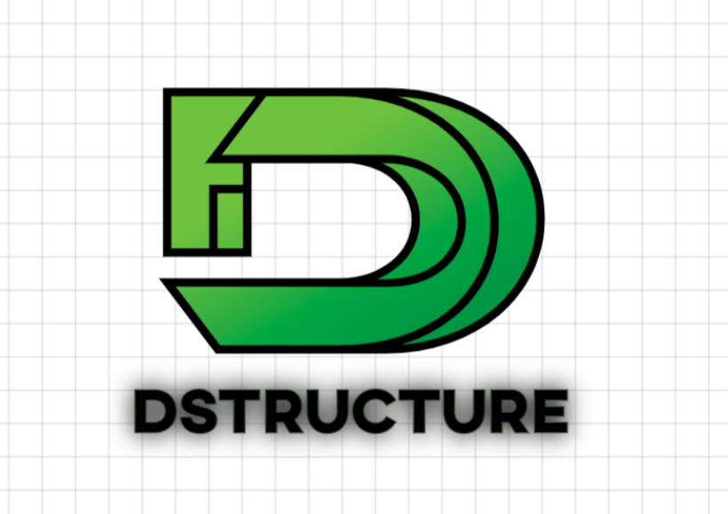

# dstructure

dstructure is a Python library for dealing with data struture and algorithms.



## Installation

Use the package manager [pip](https://pip.pypa.io/en/stable/) to install dstructure.

```bash
pip install dstructure
```

## Usage
### 1.Singly Linked List 

Singly linked list. Singly linked lists contain nodes which have a data field as well as 'next' field, which points to the next node in line of nodes. Operations that can be performed on singly linked lists include insertion, deletion and traversal.


```python
from dstructure.SLL import SLL

obj=SLL() 
obj.insert(10) # insert 10 in linked list
obj.insert(20) # insert 20 in linked list
obj.insert(30) # insert 30 in linked list
obj.insert(40) # insert 40 in linked list
obj.delete_f() # delete first node in linked list
obj.delete_l() # delete last node in linked list
obj.delete(20) # delete the node which we pass and return True otherwise False
obj.getnodes() # return all the node in linked list in list.
obj.print()	   # print all the in this format 10 -> 30 -> 40
```

### 2.Doubly Linked List 

Doubly linked list is a type of linked list in which each node apart from storing its data has two links. The first link points to the previous node in the list and the second link points to the next node in the list.

```python
from dstructure.DLL import DLL

obj=DLL() 
obj.insert(10) # insert 10 in linked list
obj.insert(20) # insert 20 in linked list
obj.insert(30) # insert 30 in linked list
obj.insert(40) # insert 40 in linked list
obj.delete_f() # delete first node in linked list
obj.delete_l() # delete last node in linked list
obj.delete(20) # delete the node which we pass and return True otherwise False
obj.getnodes() # return all the node in linked list in list.
obj.print()	   # print all the in this format 10 <-> 30 <-> 40
```

### 3.Singly Circular Linked List 

 In a singly linked list, for accessing any node of linked list, we start traversing from the first node. If we are at any node in the middle of the list, then it is not possible to access nodes that precede the given node. This problem can be solved by slightly altering the structure of singly linked list. In a singly linked list, next part (pointer to next node) is NULL, if we utilize this link to point to the first node then we can reach preceding nodes.

```python
from dstructure.SCLL import SCLL

obj=SCLL() 
obj.insert(10) # insert 10 in linked list
obj.insert(20) # insert 20 in linked list
obj.insert(30) # insert 30 in linked list
obj.insert(40) # insert 40 in linked list
obj.delete_f() # delete first node in linked list
obj.delete_l() # delete last node in linked list
obj.delete(20) # delete the node which we pass and return True otherwise False
obj.getnodes() # return all the node in linked list in list.
obj.print()	   # print all the in this format 10 -> 30 -> 40
```

### 4.Doubly Circular Linked List 

Circular Doubly Linked List has properties of both doubly linked list and circular linked list in which two consecutive elements are linked or connected by previous and next pointer and the last node points to first node by next pointer and also the first node points to last node by previous pointer. 

```python
from dstructure.DCLL import DCLL

obj=DCLL() 
obj.insert(10) # insert 10 in linked list
obj.insert(20) # insert 20 in linked list
obj.insert(30) # insert 30 in linked list
obj.insert(40) # insert 40 in linked list
obj.delete_f() # delete first node in linked list
obj.delete_l() # delete last node in linked list
obj.delete(20) # delete the node which we pass and return True otherwise False
obj.getnodes() # return all the node in linked list in list.
obj.print()	   # print all the in this format 10 <-> 30 <-> 40
```

### 5.Binary Tree 

A binary tree is a hierarchical data structure in which each node has at most two children generally referred as left child and right child. Each node contains three components: Pointer to left subtree. Pointer to right subtree. Data element.

```python
from dstructure.BTree import BTree

obj=BTree(23) 
obj.insert(10) # insert 10 in linked list
obj.insert(20) # insert 20 in linked list
obj.insert(30) # insert 30 in linked list
obj.insert(40) # insert 40 in linked list
obj.getnodes() # return all the node in linked list in list
obj.inorder()  # return inorder in list
obj.preorder() # return preorder in list
obj.postorder()# return postorder in list
```

### 6.Graph

A graph is a pictorial representation of a set of objects where some pairs of objects are connected by links. The interconnected objects are represented by points termed as vertices, and the links that connect the vertices are called edges. 


```python
from dstructure.Graph import Graph

a=Graph()
a.insert(0,1) # insert 0,1 in graph
a.insert(0,3) # insert 0,3 in graph
a.insert(1,2) # insert 1,2 in graph
a.insert(1,3) # insert 1,3 in graph
a.insert(2,3) # insert 2,3 in graph
a.insert(2,4) # insert 2,4 in graph
a.insert(3,4) # insert 3,4 in graph
a.show()     # print all graph
print(a.get_elements())   
print(a.get_vertices())  # get all the vertices
print(a.get_bfs(1))	 # breadth first search
```


### 7.HashMap

Hash tables are a type of data structure in which the address or the index value of the data element is generated from a hash function. That makes accessing the data faster as the index value behaves as a key for the data value. In other words Hash table stores key-value pairs but the key is generated through a hashing function.


```python
from dstructure.HashMap import HashMap
obj=HashMap(size) #size of array
obj.set_hash(10) # insert 10 in hashmap using value%size.
obj.search(10) # search in hashmap using value%size.
obj.ascii_hash(30) # insert 30 in hashmap by adding ascii values of all characters.
obj.ascii_search(30) # search 30 in hashmap by adding ascii values of all characters.
obj.print() # print hashmap
```


## Contributing
For major changes, please open an issue first to discuss what you would like to change.

Please make sure to update tests as appropriate.

## License
[MIT](https://choosealicense.com/licenses/mit/)